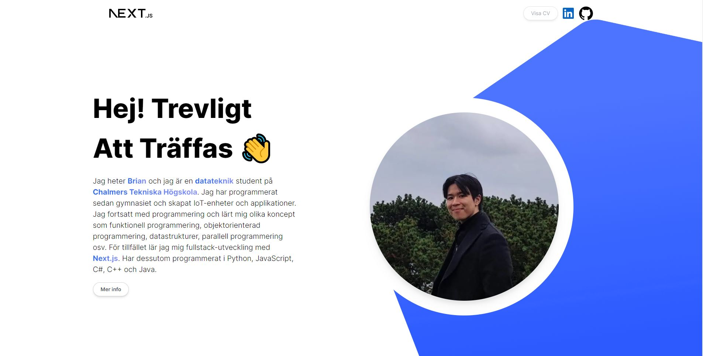

# Personal-website



This project is a personal website developed using Next.js 13, React, and Tailwind CSS. It provides individuals with a modern platform to showcase their information, portfolio, and more. The website offers a fast and dynamic user experience through Next.js, utilizes React for efficient component management, and applies Tailwind CSS for responsive and customizable styling. The project combines cutting-edge technologies to create an attractive and user-friendly personal website.

## Devlopment

Overall, this was an easy frontend project which was fun to work on. The most difficult part of the project was to make it look pleasing in the most popular screen resolutions. Tailwind made a greate part on that, and also countless trail and error from my end.

Future improvemnts:

- Increase performance, e.g image optimization
- Create modals for more information (Education and Experience part)
- Add multi language option

This is the live [`demo`](https://personal-website-gules-rho.vercel.app/) which was deployed with [`vercel`](https://vercel.com/).

## Run the project

Download all the libraries:

```bash
npm install
# or
yarn install
# or
pnpm install
```

then, run the development server:

```bash
npm run dev
# or
yarn dev
# or
pnpm dev
```

Open [http://localhost:3000](http://localhost:3000) with your browser to see the result.

You can start editing the page by modifying `app/page.js`. The page auto-updates as you edit the file.
